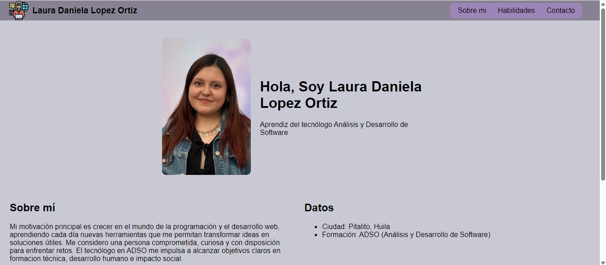
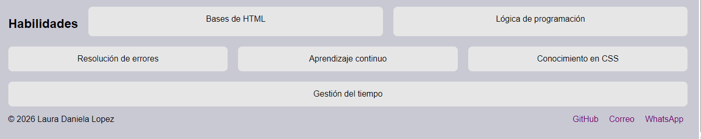
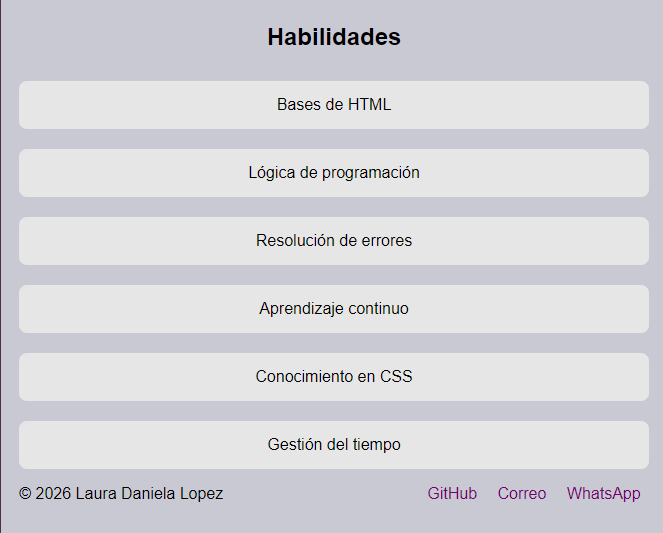

# Mi portafolio flex

## Objetivo:
Demostrar dominio de CSS Flexbox en un portafolio personal

## Características:
- Header con barra en navegación responsive
- Hero con foto y texto centrado
- Sección "Sobre mí" con dos columnas flexibles
- Galería de habilidades con tarjetas flexibles
- Footer con &copy y enlaces a redes de contacto

## Requisitos cumplidos:
- uso de display: flex, flex-wrap, gap, order
- Responsive
- HTML (header, nav, main, section, footer)
- Página dinámica con JS

## herramientas de desarrollo:
- HTML
- CSS con Flexbox (display, flex-wrap, gap, order)
- JavaScript (hacerlo dinámico)

## Estructura de archivos:
Mi_Portafolio-flex/
├── index.html
├── README.md
├── css/
│   └── estilos.css
├── js/
│   └── app.js
└── img/
    └── programacion.png
    └── miFoto.jpg
    └── vistaGeneralPortafolio
    └── vistaPantallaGrande
    └── vistaPantallaChica

## Vista previa del portafolio
Vista principal del portafolio en pantalla grande, aquí se observa la presentación personal con foto y sección "Sobre Mí", organizada con Flexbox

## Vista previa en pantalla grande vs pantalla pequeña
- Vista previa de la sección "habilidades"
- Uso de Flexbox con distribución amplia y espacio entre secciones
- Enlaces de contacto a GitHub, correo y WhatsApp
- Se usó section y footer con flexbox (flex-wrap, gap) para distribuir elementos de forma responsive
- Ideal para computadores de escritorios o portátiles

# Vista previa en pantalla pequeña
- Vista previa de la sección "habilidades"
- La interfaz se compacta y prioriza los elementos esenciales
- Uso de Flexbox con flex-wrap
- Optimizado para teléfonos

## Visualización:
link: https://ldanielalopez.github.io/Mi_Portafolio-flex/dame un vs